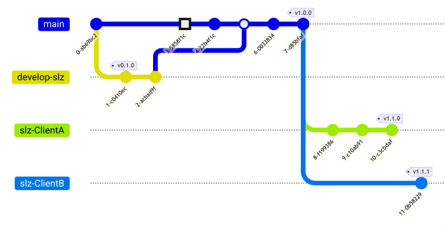

# Secure Landing Zone (SLZ) in GCP 🛡️☁️

Welcome to the **documentation** for setting up a Secure Landing Zone (SLZ) in Google Cloud Platform (GCP).
!!! note "Customization Required"
    Make sure to customize the code according to your specific requirements and organizational structure and fork your work. If you want to add improvements work them from a research feature branch and open a Pull Request froma develpment branch.
    

    <!-- ```mermaid
        gitGraph
        commit
        branch develop-slz
        commit tag:"v0.1.0"
        commit
        checkout main
        commit type: HIGHLIGHT
        commit
        merge develop-slz
        commit
        commit tag:"v1.0.0"
        branch slz-ClientA
        commit
        commit
        commit tag:"v1.1.0"
        checkout main
        branch slz-ClientB
        commit tag:"v1.1.1"
    ``` -->

---

# Google Cloud Landing Zone

---

## Introduction

A Google Cloud Landing Zone serves as the architectural foundation for your Google Cloud ecosystem. It offers standardization for resource organization, IAM roles, policy management, and more, serving as a robust template for your cloud environment.

Landing Zones are utilized across various cloud providers and aim to establish an effective operational and governance model. They guide your cloud adoption strategy, promote team collaboration, and ensure security and compliance.

---

## The Lasting Benefits of Google Cloud Landing Zone

Setting up a Google Cloud Landing Zone will pave the way for a long-lasting, secure, and manageable cloud infrastructure.

- **Resource Management**: Achieve centralized control, enhanced visibility, and auditable changes for each infrastructure modification.

- **Risk Mitigation**: Establish robust security policies and controls mapped to various compliance frameworks.

---

## Sections

This documentation comprises two key sections:

1. **SLZ Core Configurations**: Contains universally applicable configurations and resources essential for your clients. This section is relatively static and may require minor adjustments.

2. **Business Unit Configurations**: Tailored to be client-specific, this section provides guidance on setting up projects and requires extensive customization.

---

## Resources 📚

- [**Articles**](./additional-resources.md#seed) 🌱

---

# Version 🗂️

{{ git.short_commit }} ({{ git.date }}) by {{ git.author }}
