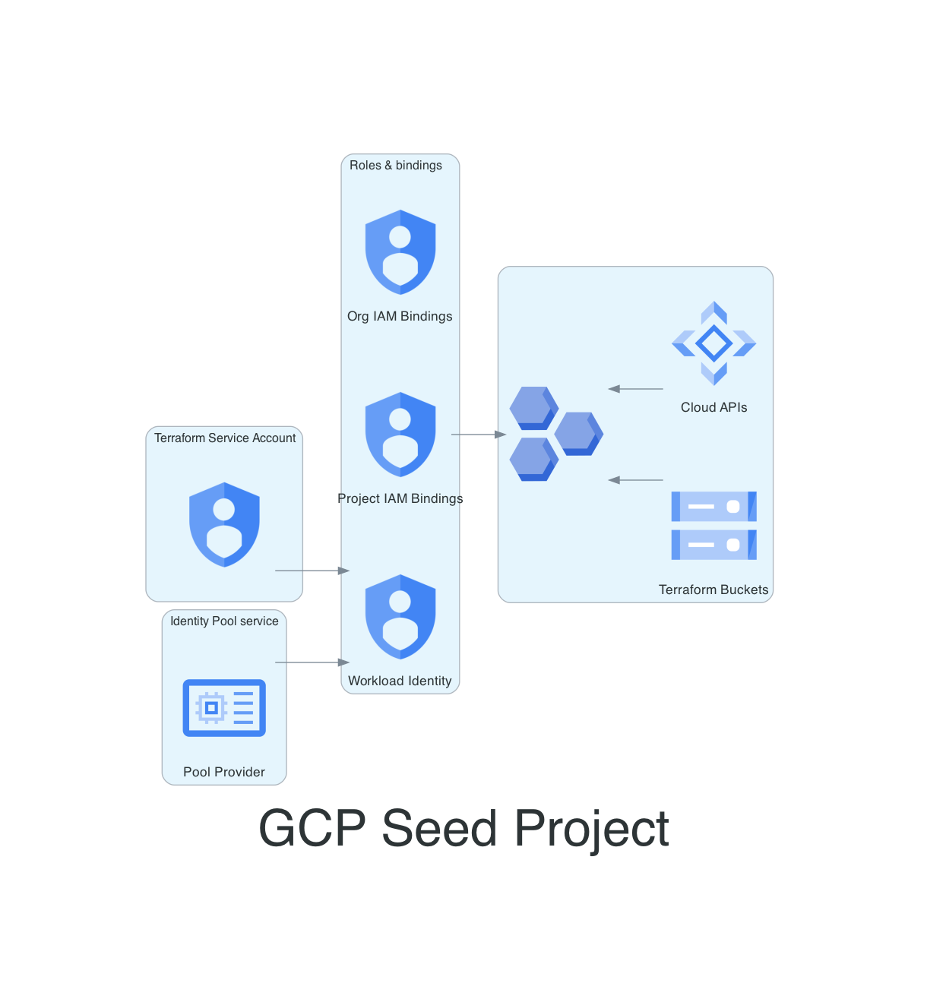

# GCP Terraform Seed 🌱☁️

## Overview 📋

This Terraform code is designed to provision the foundational setup for Google Cloud Platform (GCP) projects, services, and service accounts required for Terraform. It also manages the roles and permissions for the Terraform service account.

---

## Seed Project Concept 🌱

### What is a Seed Project? 🤔

A seed project is essentially a starting point for your infrastructure. It sets up the basic resources and permissions you need to build out your environments. This includes setting up IAM roles and Federation to run code.

!!! tip "CICD Pipeline"
    The service account created here is used by the CICD pipeline agents through impersonation to create and manage GCP resources.

### Why is it Important? 🛡️

The seed project is crucial because it lays the foundation for all your future projects and configurations.

!!! warning "Security Note"
    It ensures that you have a secure, scalable, and maintainable infrastructure by delegating roles to an impersonatable agent.

### Key Components 🔑

- **GCP Seed project**
- **Terraform Service Account**
- **IAM Roles at Organization level**
- **IAM Roles at Seed Project level**
- **Workload Identity Federation**

---

### Usage 🛠️

1. **Initialization**: An admin user needs to login using the CLI or manually apply the code in this file.
2. **State Migration**: After the initial implementation, the state for the code is stored in a cloud storage bucket.

### Requisites 📝

- A Google Cloud Platform account with sufficient permissions.
- Terraform installed on the local machine.

---
### Steps

First define the APIs to be activated.
The `module "org_seed_project"` sets up the project.
The `resource "google_service_account"` creates the service account.
IAM roles are managed through modules `"terraform_sa_organization_iam_bindings"` and `"terraform_sa_project_iam_bindings"`.
Workload Identity Federation and binding are handled with specific resources.

1. **Activation of APIs**: Flatten and set the required APIs.
project-factory/google" module.
    - `modify the values for tf-conf-variables.tf/activate_apis`

2. **Project Creation**: Setup a GCP project using the "terraform-google-modules/

    - `terraform apply -target=module.org_seed_project` 

3. **Service Account Creation**: Define a service account used by Terraform.
    - `terraform apply -target=google_service_account.tf_seed_sa` 

4. **Roles Assignment**: Set up the roles for the Terraform service account on the organization and project levels.
    - `terraform apply -target=module.tf_seed_organization_iam_bindings`
    - `terraform apply -target=module.tf_seed_project_iam_bindings`  
5. **Workload Identity Federation**: Setup Workload Identity Federation for GitHub actions.
    - `terraform apply -target=google_iam_workload_identity_pool.cicd_terraformer`  
    - `terraform apply -target=google_iam_workload_identity_pool_provider.github`  
6. **Workload Identity Binding**: Apply the workload identity binding.
    - `terraform apply -target=google_service_account_iam_binding.workload_identity`

You are now ready to enable your CICD pipeline to create resources impersonating the terraform service account.

### Notes 📝

- Make sure to uncomment the key block if needed for initial manual bootstrapping.
- The repository paths and roles can be adjusted as needed.

---
!!! info "Autogenerated Content"
    From this point on, the document is autogenerated. Do not modify it directly:(1)(2)
    { .annotate }
    
    1. diagram: documentation/docs/scripts/seed.diagrams.py
    2. code: terraform/seed.tf > documentation/docs/code/seed.code

---
!!! example "A Seed Project"
    

    [view here to view image full size](./img/seed.png)
# Code 📜


