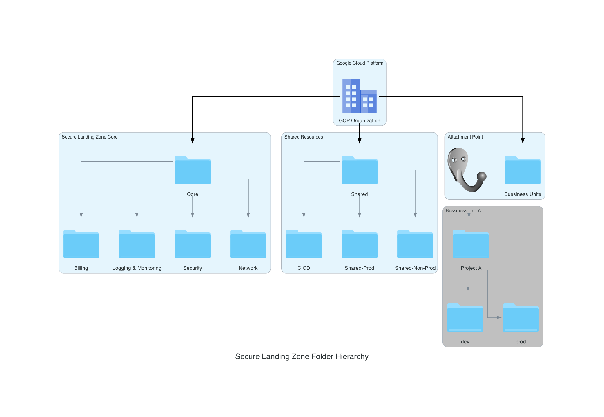

# Secure Landing Zone Folder Structure

## Overview

This code snippet defines a hierarchical folder structure within Google Cloud Platform, designed to be a core component of a secure landing zone strategy. The folder structure promotes segregation of responsibilities and isolation of different environment aspects, such as billing, logging, security, networking, and shared resources.

## Folder Structure





### Description:

- **Organizations**: The root level, representing your organization on Google Cloud Platform.
- **Core**: A foundational folder containing critical organizational resources. It includes subfolders:
  - **Billing**: Managing billing accounts and related information.
  - **Logging-Monitoring**: Segregating logging and monitoring resources.
  - **Security**: Holds security-related configurations and policies.
  - **Network**: For managing network-related resources.
- **Shared**: A folder hosting shared resources with subfolders for production and non-production environments.
- **BussinesUnits**: Businnes Unit. this folder or folders holds all projects.


### Secure Landing Zone Context

The design emphasizes security by:

- **Isolating Responsibilities**: By segregating resources into dedicated folders, you minimize the risk of unintended access or modifications.
- **Scalable Organization**: This structure allows for expandable management and the easy addition of more departments, projects, or environmental divisions.
- **Hierarchical Access Control**: Implementing IAM policies at different folder levels provides fine-grained control, supporting the principle of least privilege.
- **Auditability**: The Logging and Monitoring folder can be configured to centralize logs, improving visibility and compliance.

## Module: Folders

```
Organizations
├── Seed
│
├── Core/
│   ├── Billing
│   ├── Logging-Monitoring
│   ├── Security
│   └── Network
│
├── Shared/
│   ├── Shared-Prod
│   └── Shared-NonProd
│
└── BussinesUnits/*
```
The `module "folders"` imports the defined structure from a source module, associating it with the specific organization.

### Usage

```hcl
module "folders" {
  source = "../modules/google_folder"

  folders = {
    "Core" = { external_parent_id = "organizations/${var.org_id}" },
    // SLZ Core folders...
  }
}
```

## Resource: Random String

A random string resource is defined, used for generating a suffix. It's not directly related to the secure landing zone but may be employed for unique naming or other purposes.

### Attributes

- **`length`**: Length of the string (3 characters).
- **`special`**: Does not include special characters.
- **`upper`**: Does not include uppercase letters.
