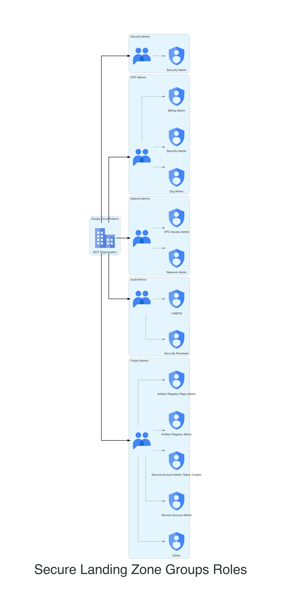

## Role Assignments for Administrative Groups in Secure Landing Zone 🛡️

!!! danger
In order to mantain this implementation as an effective and secure landing zone on GCP, you should consider the principle of least privilege,
where you should grant only the necessary access to users, groups and services to perform their tasks.

In a GCP organization, the secure management of resources requires a clear delineation of responsibilities among different administrative roles. This code snippet defines the IAM role bindings for various administrative groups within the organization, ensuring alignment with the SLZ's security principles.

By carefully attaching the appropriate roles to administrative groups, this code maintains a secure and effective governance structure. The implementation follows the SLZ principles, ensuring that access controls are applied precisely where needed and aligning with the organization's broader security strategy.

---

### Role Bindings 🔄

| Group               | Description                                                                                | Roles                                                                                                                                       |
| ------------------- | ------------------------------------------------------------------------------------------ | ------------------------------------------------------------------------------------------------------------------------------------------- |
| **GCP Admins**      | Full control over organization's resources.                                                | Organization Admin   IAM Security Admin   Billing Admin                                                                               |
| **Security Admins** | Manages security settings within the "Security" folder.                                    | IAM Security Admin                                                                                                                          |
| **Network Admins**  | Manages network resources within the "Network" folder.                                     | Compute Network Admin   VPC Access Admin                                                                                                 |
| **Audit Admins**    | Assigned roles for security review and log viewing within the "Logging-Monitoring" folder. | IAM Security Reviewer   Logging Viewer                                                                                                   |
| **Project Admins**  | Manages various roles within the "Bussines Unit" and "Shared" folders.                     | Editor   IAM Service Account Admin   IAM Service Account Token Creator   Artifact Registry Admin   Artifact Registry Repo Admin |

---

!!! info
From this point on the document is autogenerated, don't modify it directly

!!! example "SLZ Groups"

[view here to view image full size](./img/slz-groups-iam.png)

## Code


