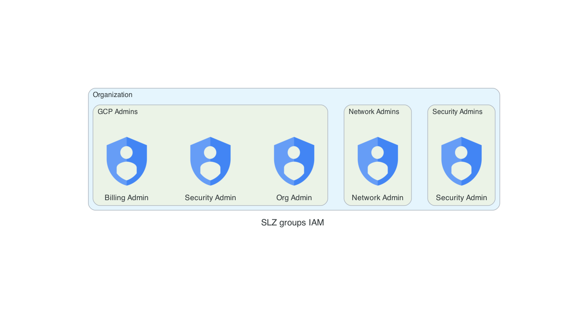

## Documentation for Secure Landing Zone Administrative Groups
These group configurations form an essential part of the Secure Landing Zone, ensuring a well-structured and secure access control hierarchy. By segregating permissions and adhering to the principle of least privilege, the implementation promotes an organized and robust security posture within the GCP environment.

### Introduction

This part of the SLZ implementation defines different groups within your GCP organization. By adhering to the principle of least privilege, we ensure that users and services have the minimum levels of access required to perform their duties.

!!! danger    
          In order to mantain this implementation as an effective and secure landing zone on GCP, you should consider the principle of least privilege,
          where you should grant only the necessary access to users, groups and services to perform their tasks.
          

### Groups Overview

The following are the key administrative groups designed to manage various aspects of the organization:
 
---
!!! info
    From this point on the document is autogenerated, don't modify it directly

!!! example "SLZ Groups"
    
---
# Code


