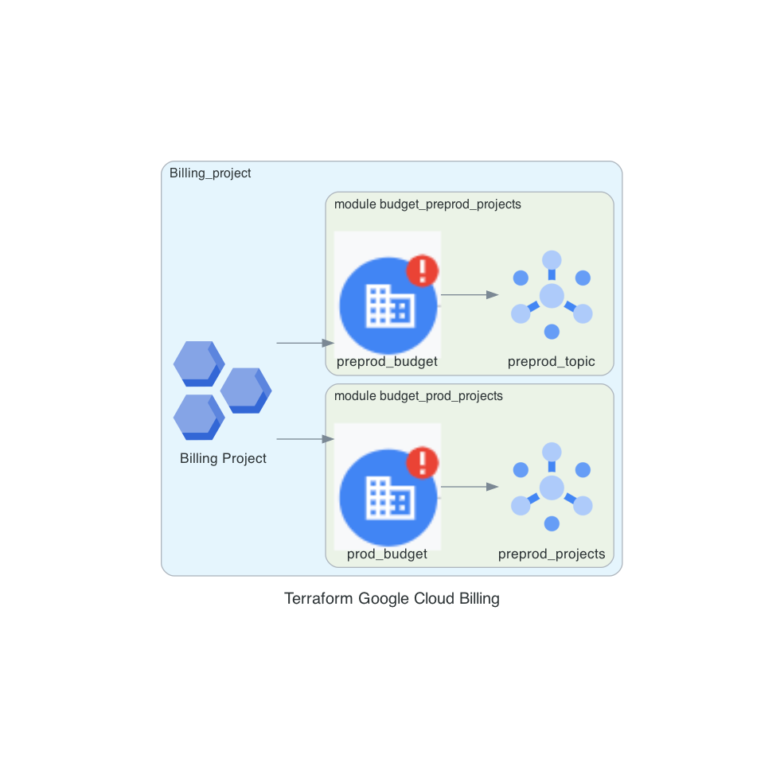

# Billing Module

This module provisions a billing project with separate budgets for production and preproduction environments, adhering to the specific SLZ requirements.

## Requirements

- Terraform 0.14 or higher
- Google Cloud Platform account
- Billing account associated with the organization

## Modules

### `billing_project`

Creates a project specifically for billing purposes.

- `name`: Name of the billing project.
- `random_project_id`: Generates a random project ID.
- `random_project_id_length`: Length of the random project ID.
- `org_id`: Organization ID.
- `folder_id`: Folder ID for billing.
- `billing_account`: Billing account.
- `budget_amount`: Total budget amount.
- `default_service_account`: Set to "disable" to disable the default service account.
- `activate_apis`: APIs to be activated for billing.
- `labels`: Environment labels such as "prod" and "preprod."

### `budget_prod_projects`

Defines the production budget with specific alert thresholds.

- `amount`: Budget amount.
- `display_name`: Display name of the budget.
- `alert_spent_percents`: List of percentages at which to send alerts.
- `credit_types_treatment`: Include all credits in the budget calculation.
- `alert_pubsub_topic`: Pub/Sub topic for sending budget alerts.

### `budget_preprod_projects`

Defines the preproduction budget with specific alert thresholds. The parameters are similar to the `budget_prod_projects` module.

## Resources

### `google_pubsub_topic`

Defines the Pub/Sub topics for production (`prod_budget`) and preproduction (`preprod_budget`) budget alerts.

## Usage

Include this module in your existing Terraform configuration and provide the necessary variables.

## Compliance with SLZ

This configuration is aligned with the specific Service Level Zones requirements, ensuring that the appropriate policies and constraints are enforced.

---

!!! info
    From this point on the document is autogenerated, don't modify it directly: (1)(2)
    { .annotate }

    1. diagram: documentation/docs/scripts/slz-projects-billing.diagrams.py
    2. code: terraform/slz-projects-billing.tf > documentation/docs/code/slz-projects-billing.code

!!! example "SLZ Billing"
    

    [view here to view image full size](./img/slz-projects-billing.png)

---

## Code


