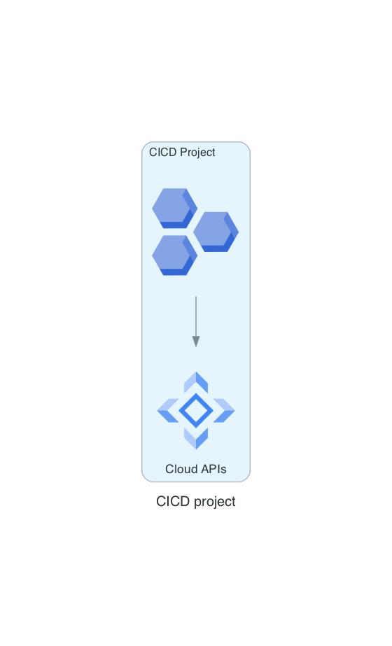

# CI/CD Module

This module sets up a CI/CD Project using Google Cloud API services, integrated within the Service Level Zones (SLZ) architecture.

## Requirements

- Terraform 0.14 or higher
- Google Cloud Platform account
- Billing account associated with the organization

## Module

### `Project factory`

Defines the CI/CD project in GCP.

- `name`: Name of the CI/CD project.
- `random_project_id`: Generates a random project ID.
- `random_project_id_length`: Length of the random project ID.
- `org_id`: Organization ID.
- `billing_account`: Billing account.
- `folder_id`: Folder ID for shared resources.
- `svpc_host_project_id`: Shared VPC host project ID.
- `activate_apis`: APIs to be activated for CI/CD.
- `labels`: Labels, such as `terraform_managed`.

---
!!! info "Autogenerated Content"
    From this point on, the document is autogenerated. Do not modify it directly:(1)(2)
    { .annotate }
    
    1. diagram: documentation/docs/scripts/slz-projects-cicd.diagrams.py
    2. code: terraform/slz-projects-cicd.tf > documentation/docs/code/slz-projects-cicd.code

---
!!! example "A CICD Project"
    

    [view here to view image full size](./img/slz-projects-cicd.png)
## Code 📜


