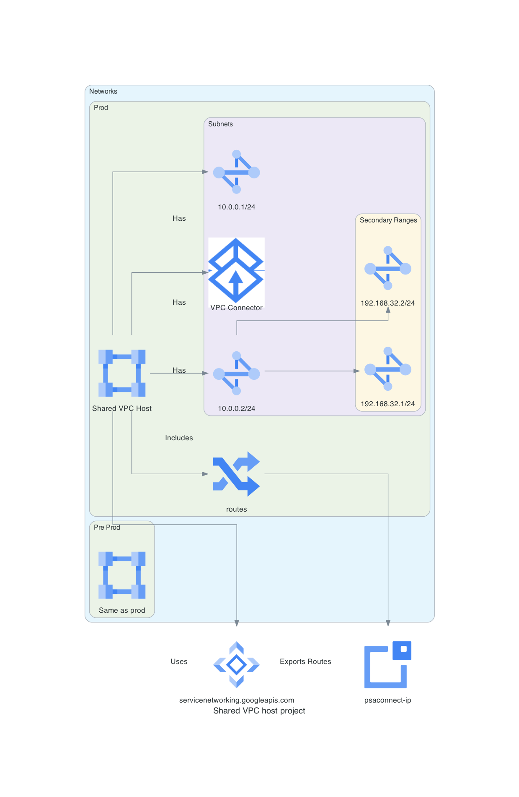

# Altus-Cor Shared VPC and Networks Configuration

This Terraform module is designed to set up the Shared VPC host project and network configuration for the Altus-Cor environment, aligned with the Service Landing Zone (SLZ) concept.

## Usage

To utilize these modules, simply include them in your Terraform project, providing the necessary variables as outlined in each module's documentation.

## SLZ Considerations

This module aligns with the principles of the Service Landing Zone (SLZ) to provide a secure and scalable network infrastructure, ensuring the separation of preproduction and production environments, while maintaining accessibility for managed services like VertexAI, CloudSQL, CloudBuild, etc.

---

!!! info "Autogenerated Content"
    From this point on, the document is autogenerated. Do not modify it directly:(1)(2)
    { .annotate }

    1. diagram: documentation/docs/scripts/slz-projects-network.diagrams.py
    2. code: terraform/slz-projects-network.tf > documentation/docs/code/slz-projects-network.code

---

!!! example "Shared VPC Project"
    

    [view here to view image full size](./img/slz-projects-network.png)

## Code 📜


