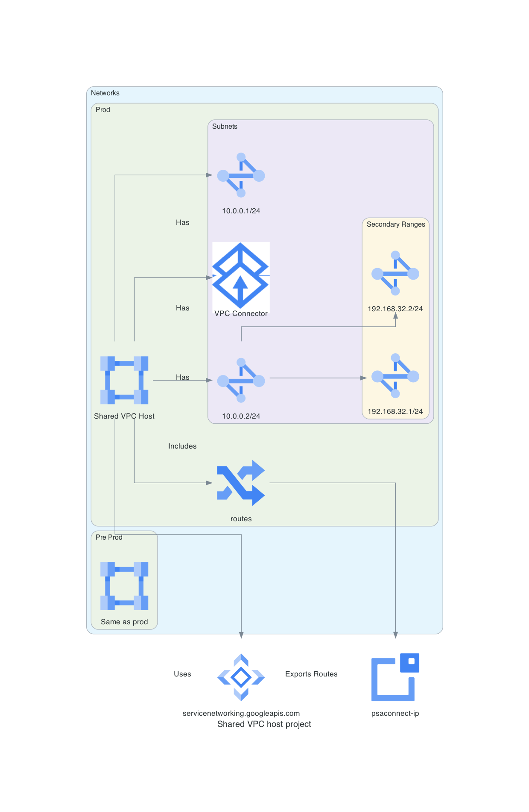

# Altus-Cor Shared VPC and Networks Configuration

This Terraform module is designed to set up the Shared VPC host project and network configuration for the Altus-Cor environment, aligned with the Service Landing Zone (SLZ) concept.

## Modules

### 1. Shared VPC Host Project

This module creates the host project for the Shared VPC, using the Terraform Google Project Factory module.

```hcl
module "shared_vpc_host_project" {
  ...
}
```

### 2. Preprod VPC

This module defines the Preprod Virtual Private Cloud (VPC) along with subnets, secondary ranges, routes, and other resources.

```hcl
module "preprod_vpc_shared_vpc_host" {
  ...
}
```

### 3. Private Service Access for Preprod VPC

The following resources create a Private Service Access Subnet for the preprod VPC and configure route import/export.

```hcl
resource "google_compute_global_address" "preprod_psa_address" { ... }
resource "google_service_networking_connection" "preprod_psa_connection" { ... }
resource "google_compute_network_peering_routes_config" "preprod_psa_route_export" { ... }
```

### 4. VPC Connector for Preprod VPC

```hcl
resource "google_vpc_access_connector" "vpcconn-preprod" { ... }
```

### 5. Cloud NAT for Preprod VPC

```hcl
module "cloud-nat" {
  ...
}
```

### 6. Production VPC

This module sets up the Production Virtual Private Cloud (VPC), including subnets, secondary IP ranges, and routes.

```hcl
module "prod_vpc_shared_vpc_host" {
  ...
}
```

## Usage

To utilize these modules, simply include them in your Terraform project, providing the necessary variables as outlined in each module's documentation.

## SLZ Considerations

This module aligns with the principles of the Service Landing Zone (SLZ) to provide a secure and scalable network infrastructure, ensuring the separation of preproduction and production environments, while maintaining accessibility for managed services like VertexAI, CloudSQL, CloudBuild, etc.

---

!!! info "Autogenerated Content"
From this point on, the document is autogenerated. Do not modify it directly:(1)(2)
{ .annotate }

    1. diagram: documentation/docs/scripts/slz-projects-sharedvpc.diagrams.py
    2. code: terraform/slz-projects-sharedvpc.tf > documentation/docs/code/slz-projects-sharedvpc.code

---

!!! example "Shared VPC Project"


    [view here to view image full size](./img/slz-projects-sharedvpc.png)

## Code 📜



<!-- ```mermaid
 "graph TD
   A[Shared VPC Host Project] -->|Creates| [Preprod VPC]

B -->|Subnets| C[owner-trans-dev-us-east4]
B -->|Subnets| D[owner-projecta-dev-us-east4]
B -->|Subnets| E[owner-cur-dev-us-east4]
B -->|Routes| F[egress-igw-preprod]
B -->|Secondary Ranges| G[trans-dev-pod]
B -->|Secondary Ranges| H[trans-dev-svc]
A -->|Creates| I[Prod VPC]
I -->|Subnets| J[owner-trans-prod-us-east5]
I -->|Subnets| K[owner-projecta-prod-us-east5]
I -->|Subnets| L[owner-cur-prod-us-east5]
I -->|Routes| M[egress-igw-prod]
I -->|Secondary Ranges| N[trans-prod-pod]
I -->|Secondary Ranges| O[trans-prod-svc]
A -->|Creates| P[Firewall Policy]
P --> Q[allow-ingress-owner-ips]
B -->|PSA| R[preprod_psa_address]
I -->|PSA| S[prod_psa_address]
B -->|VPC Connector| T[vpcconn-preprod]
I -->|VPC Connector| U[vpcconn-prod]
B -->|Cloud NAT| V[cloud-nat]
I -->|Cloud NAT| W[cloud-nat-prod]

```-->

```
